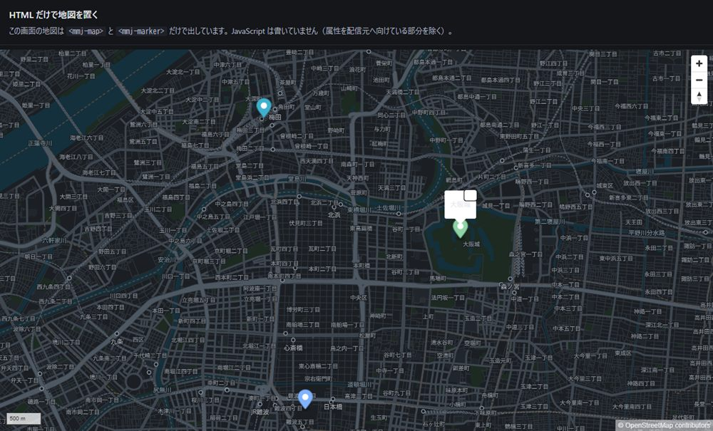
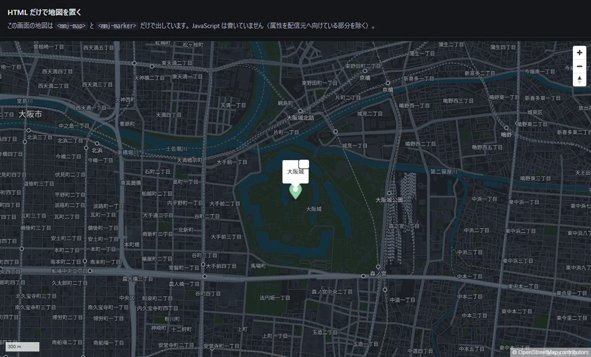

# 部品（Web Components）— S2

HTML だけで地図を置くための部品です。**ビルド工程はありません。**
`packages/elements/src/*.js` が素の ESM で、そのまま配られます。

```html
<script src="https://cdn.jsdelivr.net/npm/maplibre-gl@5.24.0/dist/maplibre-gl.js"></script>
<script src="https://cdn.jsdelivr.net/npm/pmtiles@4.4.0/dist/pmtiles.js"></script>
<script type="module" src="/elements/index.js"></script>

<mmj-map tiles="https://tiles.example.com/japan.pmtiles"
         style-url="/styles/modern-dark.json"
         center="135.5023,34.6937" zoom="12" hash>
  <mmj-marker lnglat="135.4959,34.7024" popup="大阪梅田"></mmj-marker>
  <mmj-marker lnglat="135.5258,34.6873" popup="大阪城" color="#8fd3a6" popup-open></mmj-marker>
</mmj-map>
```

手元で動かすなら `pnpm serve` のあと <http://localhost:8787/elements.html>。

## 属性

### `<mmj-map>`

| 属性 | 意味 |
|---|---|
| `tiles` | PMTiles の URL（必須） |
| `style-url` | スタイル JSON の URL（必須） |
| `center` | `経度,緯度`（GeoJSON と同じ並び）。既定は大阪 |
| `zoom` | 0〜24。既定 12 |
| `hash` | 付けると URL の `#zoom/lat/lon` で場所を持つ |

イベント: `mmj-ready`（`detail.map` に MapLibre の Map）／ `mmj-error`。

### `<mmj-marker>`

| 属性 | 意味 |
|---|---|
| `lnglat` | `経度,緯度`（必須） |
| `popup` | 押したときに出す文字 |
| `popup-open` | 最初から開いておく |
| `color` | 目印の色 |

## この部品が引き受けていること

1. `pmtiles` プロトコルの登録（1 回だけ）
2. スタイルの取得と `__TILES_URL__` の差し替え（**組み立てるのは URL だけで、色ではない**）
3. **帰属表示**（`attributionControl` を消せない形で渡す・ODbL）と
   **CJK フォントの既定**（`localIdeographFontFamily`）
4. 失敗したときに**白い地図ではなく理由を画面へ出す**
5. 子要素への map の受け渡し（`mmj-ready` を待つので、読み込み順で崩れない）

## 厚さの判断（PRD §3 の止め条件）

**素の MapLibre を呼ぶのと変わらない厚さなら、この部品は要りません。**
実測で比べます。

| 画面 | 地図を出すために書いた JS |
|---|---|
| `apps/demo/index.html`（素の MapLibre） | 約 40 行 |
| `apps/demo/elements.html`（部品） | **10 行**（属性を配信元へ向ける部分だけ。目印 3 つは HTML） |

差が出ているのは、上の 1〜4 が**呼ぶ側から見えなくなる**ためです。
特に **2 と 3 は、忘れても画面が白くならずに静かに間違う**（帰属表示が消える・
字が出ない）ので、既定に埋める価値があります。

**ここから厚くしない**のが約束です。地図の状態を抱え込む、独自のイベント体系を作る、
スタイルを組み立てる — これらをやり始めたら、素の MapLibre より薄いという根拠が消えます。

## 実物





## まだやっていないこと（S2 の残り）

- **Cluster。** 点が増えたときにまとめる部品。MapLibre の GeoJSON source が
  クラスタリングを持っているので、それを `<mmj-cluster>` から使う形を検討中です。
- **永続レイアウト**（地図の状態を保ったまま周りだけ差し替わる形）。
- **React / Vue のラッパ**（S3 / S4）。Web Components はそのまま使えるので、
  ラッパが薄くならないなら作りません。

## 実装のときに実測で見つけたこと

- **暗いページに置くと、ポップアップの文字が読めなくなる。**
  MapLibre のポップアップは白地で、文字色をページから継承します。
  暗いページ（`color: #e7e9ee` など）だと白地に明るい文字になります。
  部品側で文字色だけ戻しています（`.mmj-popup`）。**配色を決めているのではなく、
  MapLibre が元々想定している対比へ戻しているだけ**です。
- **属性は部品を読み込む前に入れる。** 逆にすると、属性が付く前に
  `connectedCallback` が走り「配信先が無い」と言って終わります。
