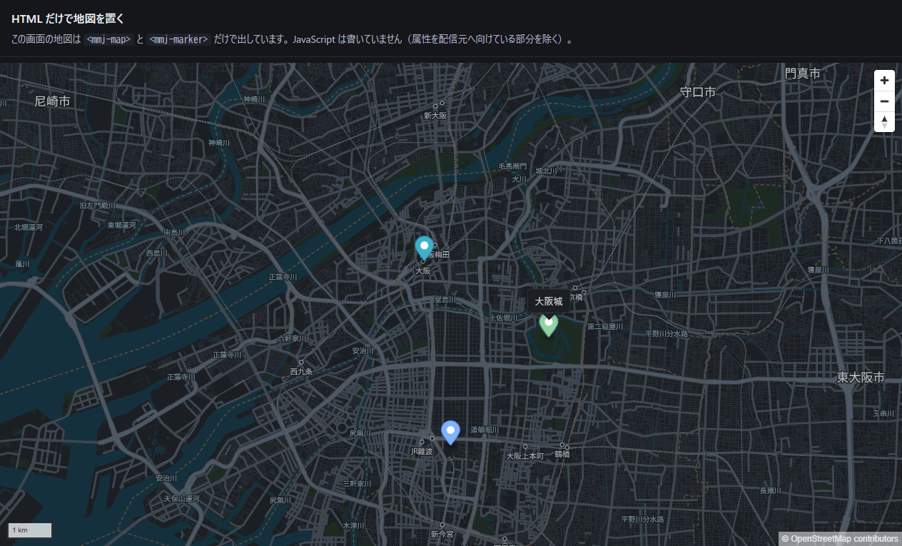
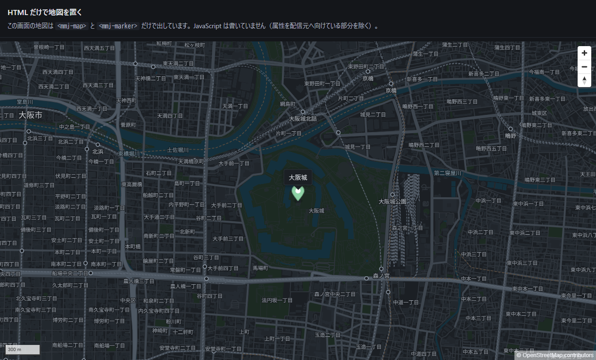
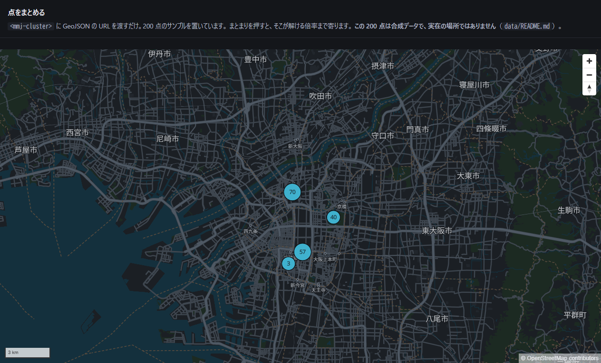
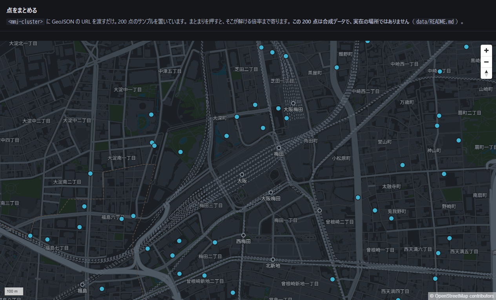
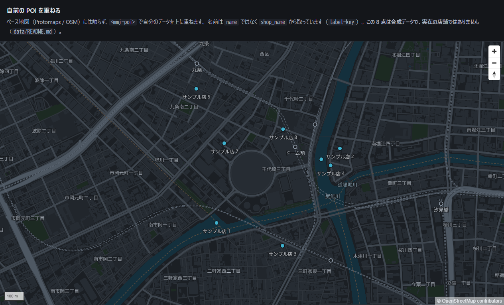

# 部品（Web Components）— S2

HTML だけで地図を置くための部品です。**ビルド工程はありません。**
`packages/elements/src/*.js` が素の ESM で、そのまま配られます。

```html
<script type="module">
  import * as maplibregl from "https://cdn.jsdelivr.net/npm/maplibre-gl@6.12.0/dist/maplibre-gl.mjs";
  window.maplibregl = maplibregl;
</script>
<script src="https://cdn.jsdelivr.net/npm/pmtiles@4.4.0/dist/pmtiles.js"></script>
<script type="module" src="/elements/index.js"></script>

<mmj-map tiles="https://tiles.example.com/japan.pmtiles"
         style-url="/styles/modern-dark.json"
         center="135.5023,34.6937" zoom="12" hash>
  <mmj-marker lnglat="135.4959,34.7024" popup="大阪梅田"></mmj-marker>
  <mmj-marker lnglat="135.5258,34.6873" popup="大阪城" color="#8fd3a6" popup-open></mmj-marker>
</mmj-map>
```

手元で動かすなら `pnpm serve` のあと <http://localhost:8787/elements.html>。
点をまとめる例は <http://localhost:8787/cluster.html>。

## 属性

### `<mmj-map>`

| 属性 | 意味 |
|---|---|
| `tiles` | PMTiles の URL（必須） |
| `style-url` | スタイル JSON の URL（必須） |
| `center` | `経度,緯度`（GeoJSON と同じ並び）。既定は大阪 |
| `zoom` | 0〜24。既定 12 |
| `hash` | 付けると URL の `#zoom/lat/lon` で場所を持つ |
| `3d` | 付けると建物を押し出す。**出したあとでも付け外しできます**（下記） |
| `pitch` | 傾き 0〜85。既定 0、`3d` を付けたときだけ 45。**`hash` と併用しても効きます**（下記） |
| `accent` | **サイトのテーマカラー 1 色**。高速道路・駅の丸の縁・目印/まとまり/POI の既定色に当たる（下記） |
| `palette-url` | 役割ごとに色を指定した JSON の URL。`accent` より優先する（下記） |
| `cooperative` | 付けると 1 本指はページ送り、2 本指だけ地図が取る。**1 ページに何枚も置くときに要る** |
| `lang` | ラベルを出す言語（`en` / `zh-Hant` / `ko` …）。**地域ごとにスタイルを増やさないための仕組み**（下記） |
| `ideograph-fonts` | 漢字かなを描くフォント。既定は日本語向け。**中国語・韓国語の地図では差し替える** |
| `no-coverage` | 付けると、**入っていない場所の表示を止める**（下記）。惑星ビルドを丸ごと配っている人向け |
| `locate` | 付けると**現在地のボタン**を出す。向きと精度の円も出る（下記）。**付けないかぎり位置情報は要求しません** |
| `fullscreen` | 付けると**全画面ボタン**を出す。**付けないかぎり出ません**（下記） |

### `fullscreen` — 地図を全画面にする

```html
<mmj-map tiles="..." style-url="..." fullscreen></mmj-map>
```

**頁の一部に置かれた地図は、周りの文字より小さいことが多い**です。
広げる手段が無いと、**指で動かすたびに周りの文字が邪魔をします**。

**勝手には出しません**。`locate` と同じで、置く側が決めます
（地図を並べた頁では、1 枚ずつにボタンが並ぶと騒がしくなります）。

### `locate` — 通信が無くても、現在地は出る

```html
<mmj-map tiles="./tiles/maihama.pmtiles" style-url="./styles/modern-dark.json" locate></mmj-map>
```

**GPS は通信が無くても動きます**。測位は衛星からで、通信ではありません。
つまり**タイルが手元にあれば、停電でも輻輳でも「いま自分がどこで、どっちを向いているか」が分かります。**
欠けていた唯一のピースは、**地図のほうがネット越しだった**ことだけでした。

| 設定 | 値 | なぜ |
| --- | --- | --- |
| `enableHighAccuracy` | `true` | **衛星を優先する**。Wi-Fi や基地局から位置を出す方式は、**まさに通信が無い場所で効かない** |
| `timeout` | **入れない** | 通信が無いと初回の測位に**数十秒**かかる（普段は軌道情報を通信で先取り＝A-GPS）。切ると**効いてほしい場面で自分から諦める** |
| `showUserHeading` | `true` | **避難では「どっちへ走るか」が要る**。点だけでは向きが分からない |
| `trackUserLocation` | `true` | 止まった点だけでは、歩いている人に使えない |

**押すまで測位は始まりません**。開いた瞬間に許可を求める画面は、それだけで閉じられます。

**事前に許可を取っておいてください**。災害時に初めて許可ダイアログを出すのでは遅い、
というのは**タイルとまったく同じ構造**です。普段使ってもらうことが、そのまま備えになります。

> **位置情報はどこへも送られません**。画面に出すだけで、保存も送信もしていません。
> 位置情報 API は HTTPS でのみ動きます（`file://` では出ません）。

### `no-coverage` — 入っていない場所の見せ方

1 つの `.pmtiles` は地球の一部しか持ちません。**その外へ動かしたとき、
何も出ないのは正常な状態**ですが、**画面からは「読み込み中」とも「壊れた」とも
区別がつきません**。

既定では、こう見せます。

1. **取りに行って空だったタイルの場所を塗る**（常時）
2. **何も描けていないときだけ、一行を出す** — 「このタイルに入っていない範囲です。
   切り出す範囲を広げると出ます。」

**宣言された範囲は使っていません。** PMTiles のヘッダは範囲を名乗りますが、
それは入っている範囲とは限りません。実測（2026-09-24・`pmtiles show`）:

    demo.pmtiles の bounds: (122.93, 20.42) - (153.99, 45.56)   ← 日本全体と名乗る

実際は **z0〜9 が全国の俯瞰・z10〜15 が大阪だけ**という二段構えで、
**四角 1 つでは表せません**。宣言を信じると、入っていない場所を
「入っている」と描くことになります。代わりに**取りに行った結果**を見ています。

実物で確認（2026-09-24・`demo.pmtiles`）: 岐阜の上 z12 で**欠けたタイル 6 枚を検出し、
一行が出た**。大阪の東の縁 z11 では**描画地物 715 件**が出ているので一行は出さず、
**境目だけが面として見える**。

止めるには `no-coverage` を付けます。

```html
<mmj-map tiles="./planet.pmtiles" style-url="./styles/modern-dark.json" no-coverage></mmj-map>
```

### `lang` — ラベルの言語

```html
<mmj-map tiles="..." style-url="/styles/modern-dark.json" lang="en"></mmj-map>
```

読み込んだあとに `text-field` を差し替えます。**スタイルは 6 枚のままです。**
地域 × 配色でスタイルを持つと **6 枚が 24 枚 48 枚と増えて破綻する**ので、色と同じく
「読み込んだあとに当てる」形にしてあります。

**`name` への落とし先は残ります**。その言語の名前が無い地物は、元の名前のまま出ます。
**消えません。**

> **日本の外では `lang` を必ず付けてください。**
> 配っている 6 枚のスタイルは `name:ja` を優先します。付け忘れると、
> **`name:ja` を持つ地物だけ日本語**になり、残りは現地語という**混在**になります。
>
> 実例（2026-09-22・実物で確認）: ホーチミンを `lang` 無しで開くと、
> 市の名前が **「ホーチミン市」** と日本語で出て、周りの水路はベトナム語のままでした。
> `lang="vi"` を付けると揃います。

#### 使えるキーは、タイルを開いて数えてください

上流が持っているキーは地域によって違います。大阪のタイルで数えた実測（2026-09-21）:

| キー | 件数 |
| --- | --- |
| `name:en` | 508 |
| `name:zh-Hant` | 20 |
| `name:zh-Hans` | 20 |
| `name:ko` | 9 |
| `name:vi` | 2 |

**`name:zh` は存在しません**。`zh-Hans` / `zh-Hant` に分かれています。推測で書くと当たりません。

```bash
pnpm tile:inspect -- dist/tiles/demo.pmtiles 12 3589 1626 --layer=places --list
```

**大阪で `lang="zh-Hant"` にしても、見た目はほとんど変わりません**（20 件しか無いため）。
**台北のタイルでは効きます**（`name:zh-Hant` が 215 件・2026-09-22 に実物で確認。
`docs/screenshots/2026-09-22-taipei-lang.jpg`）。

**件数が少ない ＝ 効かない、ではありません**。ベトナムは `name:vi` が 5 件しかありませんが、
`name` 自体がベトナム語なので `lang="vi"` で正しく出ます。

**当たらなければ例外を投げます**。言語を指定したのに元のままの地図を黙って出すと、
「指定したのに変わらない」という気づきにくい壊れ方になります。

### `ideograph-fonts` — 漢字かなのフォント

CJK のグリフは配っていないので、漢字かなは**閲覧側のフォント**で描きます。
既定は日本語向け（`Noto Sans JP` ほか）で、**中国語や韓国語の地図では字形が合いません**
（同じ符号でも国ごとに字体が違う）。

```html
<mmj-map ... lang="zh-Hant" ideograph-fonts="'Noto Sans TC', 'Microsoft JhengHei', sans-serif"></mmj-map>
```

**空文字では上書きしません**（空のフォント指定は字を消します）。

### `accent` / `palette-url` — サイトの色を当てる

**ほとんどの導入先には、そのサイトのテーマカラーがあります。**
180 行のスタイル JSON を書かせないために、色だけを渡せるようにしてあります。

```html
<!-- 1 色だけ渡す。土台は 6 枚から選ぶ -->
<mmj-map tiles="..." style-url="/styles/modern-light.json" accent="#0A5FFF"></mmj-map>
```

`accent` の 1 色が当たるのは **2 か所だけ**です。

| 当たる | 何 |
| --- | --- |
| `highway` | 高速道路の線。**画面で一番目に入る線** |
| `station` | 駅の丸の縁 |

加えて、`<mmj-marker>` / `<mmj-cluster>` / `<mmj-poi>` の**色を指定しなかったとき**の既定が
この色になります。ポップアップの箱と文字は、**土台のスタイルから借ります**
（明るいスタイルなら明るい箱）。

**地図全体をテーマカラーで塗りません**。塗ると陸・水・建物・道の区別が付かなくなり、
地図として読めなくなります。**もっと広く変えたいときは `palette-url`** を使ってください。

```html
<mmj-map tiles="..." style-url="/styles/modern-light.json" palette-url="./brand.json"></mmj-map>
```

```json
{
  "background": "#FFFFFF",
  "earth": "#FFFFFF",
  "water": "#DCE9F5",
  "buildings": "#EFF2F6",
  "road-minor": "#FFFFFF",
  "road-medium": "#FFFFFF",
  "road-major": "#F4F6F9",
  "highway": "#0A5FFF",
  "highway-casing": "#0842B5",
  "label-city": "#10172A",
  "halo": "#FFFFFF"
}
```

役割は 24 個あります。**書いたものだけが当たり、書かなかったところは土台のまま**です。

`background` `earth` `landcover` `green` `built` `paved` `water` `waterway` `buildings`
`path` `road-minor` `road-medium` `road-major` `highway-casing` `highway` `rail` `boundary`
`station` `station-fill` `label-city` `label-station` `label-neighbourhood` `label-water` `halo`

`accent` と `palette-url` を両方書いたときは `palette-url` が勝ちます（細かいほうを優先）。

**当たらなかったら例外を投げます。** 色を渡したのに 1 つも当たらない地図を黙って出すと、
「指定したのに変わらない」という気づきにくい壊れ方になります。
自前のスタイルに当てるときは、`styles/README.md` のレイヤ id を保ってください。

**こちらは色を作りません**（baseline §11 / D-002）。1 色から陸・水・道の明度を機械的に
振って土台ごと生成する案は、**D-002 が採らなかった案**なので入れていません。
必要なら提案として出します。

#### いま出来ないこと

- **読み込んだあとに `style-url` / `accent` を書き換えても切り替わりません。**
  生成時に 1 回だけ読みます。切り替えたいときは要素を置き直してください
  （`apps/demo/brand.html` がそうしています）

### 地図の時点（帰属表示に自動で出ます）

```
© OpenStreetMap contributors · 地図データ: 2026-09 時点
```

**配った `.pmtiles` は凍った成果物です**。上流は毎日更新されますが、
手元のファイルは切った日のままで、置き換えるまで古びていきます。
**画面に何も出ないと、8 か月前の地図を配り続けても誰も気づけません。**

Protomaps / planetiler で作られたタイルには、**取り込んだ OSM の時刻**が入っています。
それを読んで、`© OpenStreetMap contributors` の隣へ並べます。
**設定は要りません**。自分で切ったタイルにも同じ値が入ります。

- **OSM の取り込み時刻を優先します**。組み立て時刻とはずれます
  （実測: 取り込み 2026-09 / 組み立て 2026-03）。
  **組み立て時刻を「地図の時点」と名乗りません**
- **月までしか出しません**。日まで出すと「今日の地図」に見えるためです
- 時点が入っていないタイル（planetiler 以外）では**何も出ません**
- 読めなくても、遅くても、**地図は出ます**（3 秒で諦めます）

古びていないかは、配信先に対して数えられます。

```bash
pnpm tiles:check-age -- https://example.com/tiles/japan.pmtiles --days=90
# 地図データの時点: 2026-09-15T04:00:00Z（15 日前）
# しきい値 90 日以内です
# mmj:stale=false
```

配信先を HTTP Range で読むだけなので、**go-pmtiles は要りません**。

最後の行は**機械が読む印**です（`mmj:stale=true` / `false` / `unknown`）。
CI から使うときは、**この行を見てください**。人が読む文面は直ることがあります。

**古いこと自体では落ちません**——切り直すかどうかは人の判断です。
**時点を読めなかったときだけ落ちます**（終了コード 1）。
読めていない検査は、通った検査と区別がつかないからです。

### `3d` — 建物の押し出し

```html
<mmj-map tiles="..." style-url="..." center="135.4959,34.7024" zoom="16" 3d pitch="60"></mmj-map>
```

**タイルは 2D のときと同じものです**。足すデータも、追加の取得もありません。

| | リクエスト | 転送量 |
|---|---|---|
| 2D | 17 | 735,015 B |
| 3D | 17 | 735,015 B |

（梅田 z16 / pitch 60 の同一視点で実測・2026-09-20）

変わるのは描き方だけなので、**スタイルの決定ではなく、置く側の切り替え**にしてあります。
手書きスタイル（`styles/modern-dark.json`）は書き換えません。読み込んだ後のオブジェクトへ
押し出しレイヤを 1 枚足すだけです。

知っておくべきことが 3 つあります。

- **高さを持つ建物だけが立ちます**。実測で **3 割ほどが `height` を持ちません**
  （梅田 12,166/17,651・難波 20,383/29,435）。持たないものは 2D のまま平らに残ります。
  **既定値で埋めていません**。データに無い高さを、あるように見せないためです
- **色は決めていません**。押し出す面の色は、スタイルの 2D 建物レイヤが持っている
  `fill-color` をそのまま読みます。ここで新しい色を作ると、人が決めていない配色が
  既成事実になります
- **陰影は MapLibre の既定のままです**。面ごとの明暗を決めていません。
  `DESIGN.md` に 3D の規定が無いため、**仮置き**です

**`3d` は、出したあとでも付け外しできます。**

```js
document.getElementById('map').toggleAttribute('3d');
```

知らない街を歩くときは「その角のビルの形」が効きますが、**ずっと立っていると
上から道をたどるのが読みにくい**ので、切り替えられるようにしてあります
（デモは「建物を立てる」と「経路と案内」の左上にボタンがあります）。

- **2D の建物は消えません**。3D のときも平らなレイヤは残ります
  （高さを持たない 3 割がそこに出ます）
- **経路や目印より下に入ります**。立てても案内の線が建物に隠れません
- **足りないぶんだけ地図を動かします**。押し出しは寄って（z14 未満では 1 棟も出ない）・
  傾けて初めて見えるので、真上から見ているときだけ 45 度へ倒します。
  **すでに寄っている／傾けている人からは、その値を奪いません**


イベント: `mmj-ready`（`detail.map` に MapLibre の Map）／ `mmj-error`。

### `<mmj-marker>`

| 属性 | 意味 |
|---|---|
| `lnglat` | `経度,緯度`（必須） |
| `popup` | 押したときに出す文字 |
| `image` | 吹き出しに載せる写真の URL（**http / https と相対パスだけ**） |
| `image-alt` | 写真の代替テキスト。省くと `popup` の文字を使う |
| `popup-open` | 最初から開いておく |
| `color` | 目印の色 |

### `<mmj-cluster>`

点が多いときに、まとめて描きます。**まとめる計算は MapLibre の GeoJSON source が
持っている**ので、この部品は 3 枚のレイヤを排他の filter で置くだけです（D-011）。

```html
<mmj-map tiles="..." style-url="...">
  <mmj-cluster src="./data/sample-points.geojson" radius="50" max-zoom="14"></mmj-cluster>
</mmj-map>
```

| 属性 | 意味 |
| --- | --- |
| `src` | 点の GeoJSON の URL（必須） |
| `radius` | まとめる距離（px）。既定 50 |
| `max-zoom` | ここより寄ると、まとめずに 1 点ずつ出す。既定 14 |
| `color` | まとまりの色。既定は MapLibre の Marker と同じ `#3FB1CE` |
| `text-color` | 件数の文字色と、丸の縁の色。既定 `#111418` |
| `point-color` | ばらの点の色 |
| `layer-id` | source / layer の名前。既定は自動で振る（同じページに複数置ける） |

- **まとまりを押すと、それが解ける倍率まで寄ります。**
- **ばらの点を押すと `mmj-cluster-point` が飛びます**（`detail.properties` /
  `detail.lngLat`）。ポップアップを出すかどうかは**使う側が決めます**。
  ここで決めると厚くなるので、部品は中身を渡すところで止めています。
- **件数は色ではなく大きさで表しています**。色の段階は配色を決める行為で、
  凡例が無いまま出すと読む人ごとに違う意味に読まれます（baseline §11 / D-011）。
  既定の 2 色は**新しく作った色ではなく**、MapLibre の既定値と
  `styles/modern-dark.json` に既にある値です。**DESIGN.md が埋まるまでの仮置きです。**

### `<mmj-route>` — 経路と案内の吹き出し

```html
<mmj-map tiles="..." style-url="...">
  <mmj-route src="/data/route.geojson" fit></mmj-route>
</mmj-map>
```

| 属性 | 意味 |
| --- | --- |
| `src` | 経路の GeoJSON の URL（**必須**） |
| `fit` | 付けると、経路ぜんぶが入るところまで寄せる |
| `color` | 線の色。既定は `<mmj-map accent>`、無ければ `#3FB1CE` |
| `casing-color` | 縁取りの色。既定は地図の地色 |
| `width` | 線の太さ（px）。既定 6。縁取りは +4 |
| `step-key` | 案内文を読む属性名。既定 `instruction`（媒体ごとに違うため） |
| `step-color` | 案内の目印の色。既定は `<mmj-map accent>` |
| `layer-id` | source / layer の名前。既定は自動（同じページに複数置ける） |

渡す GeoJSON はこの形です。

```json
{
  "type": "FeatureCollection",
  "features": [
    { "type": "Feature", "properties": {},
      "geometry": { "type": "LineString", "coordinates": [[135.49,34.70],[135.50,34.69]] } },
    { "type": "Feature", "properties": { "instruction": "コンビニを左折" },
      "geometry": { "type": "Point", "coordinates": [135.495,34.695] } },
    { "type": "Feature", "properties": { "instruction": "橋を渡って右手", "image": "./corner.jpg" },
      "geometry": { "type": "Point", "coordinates": [135.50,34.69] } }
  ]
}
```

**後から足せます**。案内の点だけ増やした GeoJSON を渡せば、そのぶんだけ吹き出しが増えます。
AI に経路と案内文を作らせて、この形で渡す使い方を想定しています。

置き終わると `mmj-route-ready` が飛びます（`detail.steps` が案内の件数）。
**0 件でも気づけるように**、件数を画面へ出すことを勧めます。

#### **経路は計算しません**

計算には道路グラフとルーティングエンジンが要り、それは D-003（地図サーバーを立てない）の
外側です。**作るのは外**（ルーティング API でも、AI でも）で、ここは描くだけです。
「データを持たない。表現を持つ」の形そのものです。

### 吹き出しに写真を載せる

`<mmj-marker>` と `<mmj-route>` の案内、どちらにも載ります。

```html
<mmj-marker lnglat="135.5023,34.6937" popup="北浜の店" image="./shop.jpg" image-alt="店の外観"></mmj-marker>
```

| 属性 | 意味 |
| --- | --- |
| `image` | 写真の URL。**http / https と相対パスだけ** |
| `image-alt` | 代替テキスト。省くと `popup` の文字を使う |

**`setHTML` を使っていません**。媒体が登録した文字列をそのまま HTML として実行すると、
`` の 1 行で、その地図を置いたページ全体が乗っ取られます。
`createElement` と `textContent` だけで組むので、**文字が HTML として解釈される経路が
そもそも存在しません**（baseline §21）。

同じ理由で、`javascript:` と `data:` の画像は**黙って落とします**。
`data:` は「画像に見せかけた SVG」からスクリプトが走る経路があるためです。

### `<mmj-poi>`

**利用者が自分で持っている POI** を、ベース地図の上に重ねます。
ベース地図（Protomaps / OSM）には触りません。**MMJ はデータを持ちません**（D-001）。

```html
<mmj-map tiles="..." style-url="...">
  <mmj-poi src="/data/our-poi.geojson" label-key="shop_name" min-zoom="15"></mmj-poi>
</mmj-map>
```

| 属性 | 意味 |
| --- | --- |
| `src` | 点の GeoJSON の URL（必須） |
| `label-key` | 名前を取る属性名。既定 `name`（媒体ごとに `title` / `shop_name` と違うため） |
| `min-zoom` | ここから出す。既定 13。**件数を知っているのは持ち込む側だけ**なので既定を当てにしない |
| `attribution` | **そのデータの出典と時点**。`© OpenStreetMap contributors` の隣に出る（下記） |
| `color` / `text-color` | 点と名前の色。既定は `<mmj-cluster>` と同じ扱い（新しい色を作っていない） |
| `layer-id` | source / layer の名前。既定は自動 |
| `card-*` | 押したときに出すカードの中身。**属性名を渡すだけ**（下記） |

#### `attribution` — 出典は、地図の中に書く

```html
<mmj-poi src="./data/shelters.geojson"
         attribution="出典：○○市 指定緊急避難場所一覧（2026 年 9 月時点）"></mmj-poi>
```

**地図は単体で持ち歩かれます**。オフラインで端末に入ったあと、配布元のページは付いて来ません。
**出典を地図の外に書いても、読む人には届きません。**

とくに避難所の指定のように**間違っていると人が危ないデータ**を重ねるときは、
**どこの・いつ時点のものかが、その場で読めること**が要ります。

> **MMJ は渡されたデータを描くだけで、正しさはデータの出どころが持ちます。**
> だからこそ、**出どころを名乗れる場所**を部品が用意しています。

**時点まで書いてください**。指定は変わります。`（2026 年 9 月時点）` のような
一文が無いと、読んだ人はいつのものか確かめようがありません。
渡さなければ何も出ません（**空の出典欄を出して、出どころを騙らない**ため）。

#### `card-*` — 押したら、地図から離れずに店を見る

```html
<mmj-poi src="./data/shops.geojson" label-key="shop_name"
         card-title="shop_name" card-images="photos" card-body="description"
         card-rating="rating" card-rating-count="reviews"
         card-href="url" card-href-label="お店のページ"></mmj-poi>
```

| 属性 | 何を渡すか |
| --- | --- |
| `card-id` | **その点を一意に指す値**が入っている属性名。次/前の送りと URL の復元に要る |
| `card-title` | 名前が入っている属性名 |
| `card-images` | 写真の URL が入っている属性名。**配列でも、`,` か改行で区切った文字列でも受けます** |
| `card-body` | 説明文が入っている属性名 |
| `card-rating` / `card-rating-count` | 評価と件数。`4.3 / 5（128 件）` の形で出ます |
| `card-href` | 飛び先の URL が入っている属性名。**`http` / `https` / 相対 / `mailto:` / `tel:` だけ**通します |
| `card-href-label` | そのリンクに出す文字（`card-href` とちがい、**値そのもの**） |
| `card-tabs` | タブ。`"見出し:属性名,…"` の並び（下記） |
| `card-hours` | **曜日ごとの営業時間**が入っている属性名（下記） |
| `card-reviews` | **口コミ本文**が入っている属性名（下記） |
| `card-links` | SNS などへのリンク。`"見出し:属性名[:アイコンのURL],…"`（下記） |
| `card-rich` | **本文を HTML として読む項目**の名前。既定は読みません（下記） |
| `card-live` | **時間で変わる中身**を、開いたときに取りに行く。`"見出し:URLの型"`（下記） |
| `list` | 一覧の入れ物の CSS セレクタ。地図と一覧を繋ぐ（下記） |
| `icon-key` | 業種などの名前が入っている属性（下記） |
| `icons` | 名前 → SVG の URL。`ramen:./icons/ramen.svg,…`（下記） |

**渡すのは属性名で、値ではありません**。500 店のカードを手で書かないためです。
**媒体ごとにキーの名前が違う**（`name` / `title` / `shop_name`）ので、MMJ は推測しません。
`card-*` を 1 つも書かなければカードは出ず、今までどおり `mmj-poi-click` だけが飛びます。

**写真が 2 枚以上あると、横に流れる帯になります。**
**指で払えない画面（PC）には、左右に送りボタンが出ます**（触る画面では出ません——
指のほうが速く、ボタンは写真を隠すため）。縦に積むと、星も説明文もリンクも
画面の外へ出るためです。**次の 1 枚の端が覗く**幅にしてあるので、続きがあることが分かります。
帯は `Tab` で触れて矢印キーで送れ、読み上げには `写真 3 枚` と出ます。

#### `card-hours` — 曜日ごとの営業時間

```html
<mmj-poi src="./data/shops.geojson" card-hours="open_hours" ...>
```

```json
{
  "mon": ["10:00-18:00"],
  "wed": [],
  "sat": ["11:00-14:00", "17:00-21:00"]
}
```

「営業時間」のタブが増え、**月から日まで 7 行**出ます。
**書かれていない日と、空の日は同じ「休み**」です（勝手に営業していることにしません）。
**今日の行だけ強く**出ます。

> ### 「営業中」とは書きません
>
> **MMJ は判断しません**。いま開いているかどうかは、**時差・祝日・臨時休業・
> ラストオーダー**を知らないと言えません。知らないまま「営業中」と出すのは嘘で、
> **その嘘は、閉まった店の前に人を立たせます**。
>
> 出すのは**書かれている時間そのもの**と、**今日がどの行か**まで。
> 「いま開いているか」を出したいなら、**それは置く側が自分の責任で計算してください**
> （`card-live` で「本日 17 時まで」のように渡すこともできます）。

#### `card-reviews` — 口コミ本文

```html
<mmj-poi src="./data/shops.geojson" card-reviews="review_items" ...>
```

```json
[{ "text": "二階の座敷が静かです", "rating": 5, "name": "きの", "date": "2026-09" }]
```

「口コミ（3）」のタブが増えます。文字列の並び（`["静かでよい", "珈琲が濃い"]`）や、
改行で区切った 1 つの文字列でも受けます。

- **本文が主役**。星・名前・日付は**あるものだけ**添えます
- **本文が無いものは出しません**（名前と星だけの口コミは読めない）
- **MMJ は要約しません**。書いた人の言葉のまま出します——
  要約した時点で、**書いた人が本当に困っていた所が落ちます**

> **星の件数とは別の属性にしてください**。`card-rating-count` と同じ名前に入れると、
> **件数が消えます**（実際にやりました・2026-09-29。`4.3 / 5（128 件）` が
> `4.3 / 5` になった）。

#### `card-live` — 時間で変わる中身（クーポン・シフト・今日の品切れ）

```html
<mmj-poi src="./data/shops.geojson" card-id="shop_id"
         card-live="いま:./data/live/{id}.json" ...>
```

カードを開いたときに `./data/live/<その店の id>.json` を取りに行き、
取れたら**タブを 1 枚増やします**。返す形は `"文字列"` か `{"text": "文字列"}`。

**GeoJSON に書かないでください**。クーポンやシフトは時間で変わるので、
地図と一緒に持ち歩かれると**先月のクーポンが今日の顔で出ます**。

| | |
| --- | --- |
| 掴まない | `cache: "no-store"`。**掴むとこの機能の目的そのものが消えます** |
| 取れなくても | **カードは出ます**。そのタブだけが出ません |
| 404 | **異常ではありません**。「この店には、いまの情報が無い」として静かに扱います |
| 送って回ったとき | **遅れて返った古い応答は捨てます**（別の店の情報を今の店の顔で出さない） |
| `{id}` が無い型 | 使いません（**全店で同じものを取りに行く**壊れ方になるため） |

> ### これを使うと、「どの店を開いたか」が配信元に伝わります
>
> **MMJ の部品はどこへも送りません**が、**取りに行く先は使う側のサーバー**なので、
> そこにはアクセスの記録が残ります。**使うかどうかは置く側の判断です**
> （属性を書かなければ、取りに行きません）。
>
> 時間で変わらないもの（品書き・営業時間）は `card-tabs` で GeoJSON に持たせてください。
> **そちらは掴めるので、オフラインでも出ます。**

#### `card-rich` — 本文に文中リンクと強調を書く

```html
<mmj-poi src="./data/shops.geojson"
         card-body="description"
         card-rich="description" ...>
```

**既定では、本文は文字として出ます**。`<a>` と書いても、そういう文字が出るだけです。
`card-rich` で**項目を名指ししたときだけ**、その項目を HTML として読みます。

```
二階は<strong>予約席</strong>です。<a href="/reserve">席を予約する</a>と、窓際を確保できます。
```

| 許すタグ | `a` `b` `br` `em` `i` `li` `ol` `p` `strong` `ul` |
| --- | --- |
| 許す属性 | **`a` の `href` だけ**。`target` と `rel` はこちらが付けます |
| 落とすもの | 上に無いタグ、**すべてのイベント属性**（`onerror` など）、`style`、安全でない `href` |
| 中身ごと捨てるタグ | `script` `style` `template` `noscript` `iframe` `object` `embed` |

**タグが落ちても、中の文字は残します**（知らないタグで文章ごと消さないため）。
`href` は他のリンクと同じ判定を通り、`http` / `https` / 相対 / `mailto:` / `tel:` だけが通ります。

> **なぜ既定で閉じているのか。**
>
> 置く側が自分でデータを書くなら、HTML を許しても**自分のページに自分で書くのと同じ**で安全です。
> ただし**店舗が CMS で紹介文を書く**使い方や、`card-live` が実行時に取りに行く JSON では、
> 書く人は置く側ではありません。1 件が `` を書くだけで、
> **その地図を置いた全ページ**が乗っ取られます。
>
> **部品はどちらか判定できません**。だから既定を安全側に置き、置く側が名指ししたときだけ開きます。
> **他人が書く文字列を入れる項目には、`card-rich` を指定しないでください。**

#### `card-links` — SNS や電話へのリンク

```html
<mmj-poi src="./data/shops.geojson"
         card-links="写真:sns_url:./icons/ig.svg,公式:site_url,電話:tel" ...>
```

**MMJ はブランドのアイコンを配りません**。商標なので、こちらが持つと
**使う側が意図しない形で配る**ことになります。**アイコンは置く側が渡してください**
（3 つ目に URL を書く）。省くと文字だけのリンクになります。

- **中身のあるものだけ出ます**。SNS をやっていない店にリンクは出ません
- **URL は確かめます**。`http` / `https` / 相対 / `mailto:` / `tel:` 以外は落とします
  （`javascript:` は押した瞬間に走るので、**アイコンの URL も同じ目で見ます**）
- 外部へ出るリンクは `target="_blank"` ＋ `rel="noopener noreferrer"`

#### `card-tabs` — 品書き・クーポン・営業時間を 1 枚に入れる

```html
<mmj-poi src="./data/shops.geojson"
         card-tabs="品書き:menu,クーポン:coupon,営業時間:hours" ...>
```

**長文の下に足していくと、開いた人は下まで読みません**。タブなら 1 枚のカードに並びます。

- **`見出し:属性名` の組**を並べます。**見出しだけが値**——媒体の属性名を
  そのまま出すと、画面に `menu` と出てしまいます
- **最初のタブは「概要**」（星・長文・リンク）。いままでどおり最初に見えます
- **題と写真はタブの外**に残ります。切り替えた先が何の店か分からなくならないように
- **中身が空のタブは出ません**。クーポンのある店と無い店が混ざるのが普通なので、
  **押しても何も出ないタブを並べない**
- **改行は残します**（`white-space: pre-line`）。品書きは行で分かれているのが中身そのもの
- タブは `Tab` で入り、**左右キーで切り替え**られます（`role="tablist"` の作法）
- **中身は消さずに隠します**。作り直すと、そのタブで読んでいた位置が毎回戻ります
- **1 枚しか中身が無ければ、タブの帯は出ません**

> **時間で変わるものを、地図と一緒に配らないでください**。クーポンやシフトは
> GeoJSON に書いた時点の値です。**古い値が地図と一緒に持ち歩かれる**ことを
> 前提に、期限を本文へ書くか、開いたときに取りに行く形にしてください。

#### `card-id` — 隣の店へ送る・URL で戻す

`card-id` を渡すと、次の 2 つが増えます。**渡さなければどちらも出ません。**

1. **見出しバーに [‹] [›] が出ます**。カードを開いたまま隣の点へ送れます。
   **閉じて開き直しません**ので、最大化したまま・写真をめくった位置もそのままで送れます。
   端まで行ったら反対側へ回ります（端でボタンを消すと**押す場所が動く**ため）
2. **開いている点が URL に残ります**（`?shop=<id>`）。その URL を開くと、
   **その点まで地図が寄って、カードが開いた状態で始まります**

```html
<mmj-poi src="./data/shops.geojson" card-id="shop_id" card-title="shop_name" ...>
```

> **`#` ではなく `?` に書きます**。`<mmj-map hash>` を付けると MapLibre が
> `#15/34.70/135.49` を書きますが、**その実装は自分の形以外を捨てます**
> （5.24.0 と 6.12.0 で確認）。`#shop=` に置くと、**地図を少し動かしただけで消えます**。
> 消えたことは画面に出ないので、**共有して初めて壊れているのが分かります**。

**一覧はもう一度読みます**。送るにも復元するにも順番の付いた一覧が要り、
`querySourceFeatures` は**画面に出ているぶんしか返さず、順番も保証されません**。
同じ URL なのでブラウザの控えが効きます（地図がすでに取っています）。

**履歴は積みません**（`replaceState`）。押して回るたびに履歴が増えると、
**頁から出るのに戻るボタンを何度も押す**ことになります。

見出しバーの **[⤢] で広げられます**（[⤡] で戻る、`Esc` は 1 段だけ戻る）。
**広げても地図は消えません**——広い画面では横幅が伸びるだけで、地図は右に残ります。

**広い画面では、地図の左から出る面になります**（Google マップの店舗欄と同じ形）。
吹き出しは点に貼り付くぶん幅が取れず、**写真も口コミも読めません**
（PC の吹き出しは狭く、Google マップのように横から大きく出してほしい、
という指摘・2026-09-29）。
**この面では写真を敷き詰めます**——1 枚目を大きく、残りを並べる形で、
**横スライダーは出しません**（マウスでは横に払えないため）。

#### `icon-key` / `icons` — 点を自前のアイコンにする

```html
<mmj-poi src="./shops.geojson"
         icon-key="category"
         icons="ramen:./icons/ramen.svg,udon:./icons/udon.svg,cafe:./icons/cafe.svg"></mmj-poi>
```

```json
{ "properties": { "shop_name": "らーめん 汀", "category": "ramen" } }
```

点が全部同じ丸だと、**地図を見ても何屋かが分かりません**。
うどん・ラーメン・ケーキ・コーヒーが一目で分かれば、**開く前に選べます**。

- **絵は同梱しません**。業種の分け方も絵の趣味も置く側のものです（MMJ はデータを持ちません）
- **アイコンが無い点は、いままでの丸のまま**。分類の無い点も、綴りの違う点も、静かに丸になります
- **1 枚読めなくても地図は出ます**。読めなかった名前はコンソールに出します
- 絵は **26px 四方**で描きます。SVG に寸法が無くても出るよう、こちらで決めています
- **重なっても消しません**（名前は消えますが、何屋かが消えると地図の意味が変わるため）

> **SVG は `` として読みます**。`` に入れた SVG の中では
> スクリプトが動かないので、持ち込まれた絵から script が走る経路はありません。
> `javascript:` の URL は、吹き出しのリンクと同じ規則で落とします。

**選ばれている点は、絵の後ろに輪が出ます**（絵より大きい輪なので、絵に隠れません）。

#### `list` — 地図と並ぶ一覧

```html
<mmj-poi src="./shops.geojson" card-id="shop_id" card-title="shop_name"
         list="#shop-list"></mmj-poi>

<ul id="shop-list">
  <li><a href="?shop=akari" data-shop="akari">町家カフェ 灯</a></li>
  <li><a href="?shop=migiwa" data-shop="migiwa">らーめん 汀</a></li>
</ul>
```

カードは送りボタンで 1 件ずつしか回れません。3 件なら足りますが、
**20 件を「探す」ことはできません**。一覧はそこを埋めます。

**一覧は HTML に書いてください**。そこに文字があるから、

- **検索に出ます**（店名も評価も、いまは HTML に 1 文字もありません）
- **JS を切っても読めます**
- **Tab で届きます**（点は canvas の上の描画なので、キーボードでは 1 件も触れません）

`data-shop` の値が `card-id` の指す値と一致した項目に、
**開いている店の印**（`aria-current="true"`）が付きます。見た目は置く側が決めます。

押すと**頁を読み込み直さずに**カードが開き、地図がその点まで寄ります。
`href` は本物のリンクなので、**Ctrl+クリックで新しいタブ**にも、
**JS を切った状態**にも、そのまま効きます。

> **入れ物が空なら、部品が一覧を作ります**。探すのとキーボードには効きますが、
> **検索には効きません**（読み込んだ後に生えるため）。
> 検索に効かせたいなら、**HTML に書いてください**——
> 実際のサイトでは CMS や静的サイト生成が、地図の GeoJSON と一覧を同じ元から出します
> （MMJ はデータを持ちません）。

**矢印で送ったとき、どの点の話かが分かります。**

- 開いている点だけ**大きくなります**（別のレイヤなので、**密集していても隣の点に隠れません**）
- 点の上に**名前だけの小さな吹き出し**が残ります。面には読むものがあり、こちらは
  「ここ」を示すためだけのものです
- 選ばれている点の名前は、**地図のラベルからは消します**（同じ文字が 2 つ並ぶため）

これには `card-id` が要ります（点を id で引けないと印を立てられません）。

**狭い画面では、下から出る面になります**。地図は上に残り、
**押した点が面に隠れないよう、地図のほうが動きます**（Google マップ・Apple マップと同じ形）。
全面にすると、**「押した点」と「出てきた面」のつながりが切れます**。

**見出しバーをつまんで、高さを変えられます**。上へ引けば全面、下へ引けば元の高さ、
さらに下へ引くと閉じます。**指に追いて動きます**——しきい値だけで切り替えると、
離すまで何も起きず、**やはり動かないものに見えます**
（実際に「下から出る風で、実際動かない」という指摘を受けています・2026-09-29）。
**中身は作り直さないので、めくった位置はそのまま**です。
**狭い画面では最初から広げて開きます**（幅 360px の吹き出しに写真は入らないため）。

> **この部品は、どこへも何も送りません**。「利用者がどこを見たかが第三者に渡らない」が
> MMJ の主張なので、部品が勝手に送り始めたら、その主張が嘘になります。
> 何を数えるかは、`mmj-poi-click` を受けた側が決めてください。

#### 出来事（数えたいとき）

| 出来事 | いつ | `detail` |
| --- | --- | --- |
| `mmj-poi-click` | **点が押された**とき | `properties` / `lngLat` |
| `mmj-card-open` | **カードが開いた**とき（押した・送った・URL から復元した、すべて） | `properties` / `lngLat` / `index` / `total` / `id` |
| `mmj-card-step` | **[‹] [›] で送った**とき | `delta`（次へ 1・前へ -1） / `index` / `total` |

**数えるなら `mmj-card-open` です**。`mmj-poi-click` は「点が押された」ことしか
言いません。送って回ったぶんも、共有 URL から開いたぶんも入りません。

```js
document.addEventListener('mmj-card-open', (event) => {
  // 例: 自分の集計へ。**MMJ はどこへも送りません**
  console.log(event.detail.id, event.detail.index, '/', event.detail.total);
});
```

> **`document` でも、`<mmj-map>` でも、`<mmj-poi>` そのものでも受け取れます。**
> どれで待っても **1 回だけ**届きます。

- **押すと `mmj-poi-click` が飛びます**（`detail.properties` / `detail.lngLat`）。
  何を出すかは使う側が決めます。
- **名前は衝突したら消えます**（`text-allow-overlap: false`）。重ねて出しても読めないためで、
  **点は残るので場所は分かります**。実物（`2026-09-17-poi-z15.jpg`）でも 8 点中 1 つの名前が
  衝突で消えています。
- `<mmj-cluster>` との使い分け: **まとめたいときはクラスタ、1 点ずつ名前を出したいときはこちら。**

## この部品が引き受けていること

1. `pmtiles` プロトコルの登録（1 回だけ）
2. スタイルの取得と `__TILES_URL__` の差し替え（**組み立てるのは URL だけで、色ではない**）
3. **帰属表示**（`attributionControl` を消せない形で渡す・ODbL）と
   **CJK フォントの既定**（`localIdeographFontFamily`）
4. 失敗したときに**白い地図ではなく理由を画面へ出す**
5. 子要素への map の受け渡し（`mmj-ready` を待つので、読み込み順で崩れない）

## 厚さの判断（PRD §3 の止め条件）

**素の MapLibre を呼ぶのと変わらない厚さなら、この部品は要りません。**
実測で比べます。

| 画面 | 地図を出すために書いた JS |
|---|---|
| `apps/demo/index.html`（素の MapLibre） | 約 40 行 |
| `apps/demo/elements.html`（部品） | **10 行**（属性を配信元へ向ける部分だけ。目印 3 つは HTML） |

差が出ているのは、上の 1〜4 が**呼ぶ側から見えなくなる**ためです。
特に **2 と 3 は、忘れても画面が白くならずに静かに間違う**（帰属表示が消える・
字が出ない）ので、既定に埋める価値があります。

**ここから厚くしない**のが約束です。地図の状態を抱え込む、独自のイベント体系を作る、
スタイルを組み立てる — これらをやり始めたら、素の MapLibre より薄いという根拠が消えます。

## 実物





200 点を `<mmj-cluster>` で置いたところ（z11 でまとまり、z15 でばらける）。
**この 200 点は合成データで、実在の場所ではありません**（`apps/demo/data/README.md`）。





自前の POI を `shop_name` から出したところ。**中央の丸い建物（京セラドーム）に名前が
付いていないのは、ベースのスタイルに POI レイヤが無いから**です。
**配るスタイルは駅だけを描いています**（駅以外の POI は、置く側が自分で足します）。



## まだやっていないこと（S2 の残り）

- **React / Vue のラッパ**（S3 / S4）。Web Components はそのまま使えるので、
  ラッパが薄くならないなら作りません。

## 実装のときに実測で見つけたこと

- **暗いページに置くと、ポップアップの文字が読めなくなる。**
  MapLibre のポップアップは白地で、文字色をページから継承します。
  暗いページ（`color: #e7e9ee` など）だと白地に明るい文字になります。
  部品側で文字色だけ戻しています（`.mmj-popup`）。**配色を決めているのではなく、
  MapLibre が元々想定している対比へ戻しているだけ**です。
- **属性は部品を読み込む前に入れる。** 逆にすると、属性が付く前に
  `connectedCallback` が走り「配信先が無い」と言って終わります。
- **`mmj-ready` の時点では、まだ source を足せない。** `mmj-ready` は Map を作った直後に
  出ますが、そこではスタイルがまだ読み終わっていません。`addSource` すると例外になります。
  `<mmj-cluster>` は `isStyleLoaded()` を見て、必要なら `load` を待ってから足しています。
- **GeoJSON を配るとき、content-type が `application/octet-stream` だと紛らわしい。**
  MapLibre は中身を見に行くので描けますが、掴んだ側が何のファイルか分かりません。
  `tools/serve` に `.geojson` → `application/geo+json` を足しました。

### `hash` と `pitch` を一緒に使うとき

**MapLibre の hash は `#zoom/lat/lng/bearing/pitch` の 5 要素です。**
3 要素しか書かれていない URL を開くと、**bearing と pitch が 0 に戻されます。**

そのままだと、**3D のページを URL で渡した相手の画面では建物が平らになります。**
実際にそうなりました（2026-09-20・撮って気づいた）。

```
#16/34.7024/135.4959        → pitch 0 に戻る。建物が立たない
#16/34.7024/135.4959/0/60   → 立つ
```

**部品側で当て直しています**。hash が pitch を持っていないときだけ、
属性の `pitch` を地図へ当て直します。**持っているときは触りません**
（利用者が URL で指定した角度を奪わないため）。

## `<mmj-raster>` — 地図に重ねる画像タイル

```html
<mmj-map tiles="./tiles/demo.pmtiles" style-url="./styles/modern-dark.json">
  <mmj-raster src="https://example.com/hazard/{z}/{x}/{y}.png"
              attribution="出典：○○市 洪水浸水想定区域図（2026 年 9 月時点）"
              opacity="0.6"></mmj-raster>
</mmj-map>
```

**1 つで広く効きます**。雨雲レーダー・ハザードマップ・地盤・震度・空中写真は、
どれもラスタタイルで配られています。

| 属性 | 意味 |
| --- | --- |
| `src` | タイルの URL（必須）。**`{z}` `{x}` `{y}` が揃っていること** |
| `attribution` | **そのデータの出典と時点**。地図の中に出ます |
| `opacity` | 濃さ 0〜1。**既定 0.7** |
| `min-zoom` / `max-zoom` | 出す倍率の範囲 |
| `before` | このレイヤの下へ入れる。**既定はいちばん手前のラベルの下** |
| `tile-size` | 既定 256 |
| `layer-id` | source 名。**1 枚に 2 つ重ねるときは分ける** |

### 既定が「透ける」「ラベルの下」である理由

**不透明のまま重ねると、その色がどこの話なのか読めません**。浸水想定でも雨雲でも、
**現在地と道が透けて見えて初めて使えます**。

**ラベルの上に重ねると、地名も駅名も消えます**。既定でいちばん手前のラベルの下へ入れます。

### 読めない URL は落とします

`{z}` `{x}` `{y}` のどれかが欠けていると、MapLibre は**同じ 1 枚を延々と貼り続けます**。
地図は出るので**見ても間違いだと分かりません**。`console.error` を出して、重ねません
（**地図は殺しません**）。

### MMJ はデータを持ちません

出どころを指すのも、出典を名乗るのも導入者です。**MMJ は判断しません** ——
重ねた色が何を意味するかも、いつ時点のものかも解釈しません。

> **気象のデータを重ねるときの注意**。気象庁の予報をそのまま出すだけなら
> 予報業務許可は要りませんが、**独自の予想を足すと許可が要ります**（気象業務法）。
> 「この降り方なら 30 分後にここが危ない」のような表示は、そこに入ります。

> **国土地理院のタイルを重ねるときの注意**。測量成果の利用にあたるかどうかは
> 導入者側の判断になります（MMJ 本体はこれを同梱しません。`PRD.md` §2）。

## 防災・避難で使うときの約束

**この分野では、精度と出典を厳しく扱ってください**（2026-09-27・人の判断）。
地図は単体で持ち歩かれ、**間違っていると人が危ない**種類のデータだからです。

### 1. 出典と**時点**を、地図の中に出す

`<mmj-poi>` にも `<mmj-raster>` にも `attribution` があります。**配布元のページに
書いても届きません**——オフラインで端末に入ったあと、そのページは付いて来ません。

### 2. **制度に依存する語**を出すなら、いつの制度かも書く

警戒レベル・警報名・避難情報の区分は**変わります**。
「レベル 4」とだけ書いてあると、読んだ人はいつの制度の話か確かめようがありません。

```html
<mmj-poi src="./shelters.geojson"
         attribution="出典：○○市 指定緊急避難場所一覧（○年○月時点・警戒レベルは○年○月改定に対応）"></mmj-poi>
```

### 3. 架空のものは、**架空だと明示する**

訓練用に作った地点や経路を、実在のものに見える形で置かないでください。
**実在のデータに見えるものを作り置くと、いつか誰かがそれを本物として使います。**
MMJ のデモもそうしています（`apps/demo/data/README.md`）。

### 4. **確かめていないものは、確かめていないと書く**

型だけ合わせて中身を埋めると、**読んだ人には確かめ済みと区別がつきません。**

### 5. **この手引き自身も、情報源ではありません**

上の例に出てくる日付や自治体名は、**書き方を示すための穴埋め**です（`○年○月`）。
**確かめていない具体的な数値を、例示として置きません**——例示は写されるからです。

**MMJ は地図を描く道具であって、情報源ではありません。**
同じ理由で、警戒レベルの一覧表のような**制度の中身をここに持ちません**。
持てば維持する義務が生まれ、**古くなった表が「MMJ が言っている」形で残ります**。

> **MMJ 側は判断しません**。渡されたものを描くだけで、正しさはデータの出どころが持ちます。
> **だからこそ、出どころを名乗れる場所を部品が用意しています。**

## `<mmj-fill>` — 面を値で塗り分ける

浸水深・地盤・震度・土砂災害の区域のような、**値を持つ面**を重ねます。

```html
<mmj-map tiles="./tiles/demo.pmtiles" style-url="./styles/modern-dark.json">
  <mmj-fill src="./data/flood.geojson" value-key="depth"
            steps="0.5:#cfe8ff,1:#8ec6ff,3:#3b82f6,5:#1e3a8a"
            legend="浸水深（m）"
            attribution="出典：○○市 洪水浸水想定区域図（○年○月時点）"></mmj-fill>
</mmj-map>
```

| 属性 | 意味 |
| --- | --- |
| `src` | 面の GeoJSON の URL（必須） |
| `value-key` | **どの属性で塗り分けるか**（必須）。文字で入っていても数として読みます |
| `steps` | `"しきい値:色,…"`（必須）。**小さい順に並べ直します** |
| `legend` | 凡例の見出し。**渡さなければ凡例は出ません**（下記） |
| `opacity` | 透かし具合。既定 0.55。**下の地図が読めなくなると避難に使えません** |
| `before` | この layer の下に入れる。既定は**最初のラベル層の下** |
| `attribution` | **出典と時点**。`© OpenStreetMap contributors` の隣に出ます |

### 色はこちらで作りません

**ハザードマップの配色は、国や自治体が決めた意味のある色**です
（浸水深の青、土砂災害の黄と赤）。**独自配色に置き換えると誤読を生みます**
——`CLAUDE.md`「外界が色を決めているものは、配色ルールの適用外」。

`steps` は**置く側が渡すもの**で、MMJ は並べ替えて塗るだけです。

### しきい値より下は塗りません

`0.1m の浸水` を薄い青で塗ると、**浸水していない場所と見分けがつかない**まま
色だけが付きます。最初のしきい値に届かない地物と、**値を持たない地物**は
透明のままにしてあります。

### 凡例は、見出しを渡したときだけ出ます

**色だけ出しても、濃い青が何メートルかは誰にも分かりません。**
ただし**単位も見出しも知らないまま数字だけ並べると、読んだ人が意味を作ってしまう**ので、
`legend` を渡したときだけ出します。区間で読ませ、**最後は「以上**」にしています
（上限を書くと、そこで終わると読めてしまうため）。

> ### MMJ は判断しません
>
> **「ここは危ない」とも「逃げろ」とも言いません**。渡された値を、
> 渡された色で塗るところまでです。上の「防災・避難で使うときの約束」を必ず読んでください。
>
> 実物は <http://localhost:8787/flood.html>（**架空の見本**です。
> 四角が規則的に並んでいるのがその印で、実際の浸水想定は地形なりの形になります）。

## `<mmj-circle>` — ここから半径◯ m

```html
<mmj-map tiles="./tiles/maihama.pmtiles" style-url="./styles/modern-dark.json" locate>
  <mmj-circle center="139.8850,35.6305" radius="800"></mmj-circle>
  <mmj-circle center="139.8850,35.6305" radius="1600" color="#ffa03c"></mmj-circle>
</mmj-map>
```

**外部サービスもデータも要りません**。幾何だけで出ます。

| 属性 | 意味 |
| --- | --- |
| `center` | `経度,緯度`（必須） |
| `radius` | 半径（**m**・必須）。0 以下は描きません |
| `color` | 面と縁の色。既定は `<mmj-map accent>`、無ければ淡い青灰 |
| `fill-opacity` | 面の濃さ 0〜1。**既定 0.12** |
| `steps` | 円周の分割数。既定 96 |
| `before` | このレイヤの下へ入れる |
| `layer-id` | source 名。**何重にも置くときは分ける** |

### 画面上の円を使っていません

MapLibre の `circle-radius` は**画面のピクセル**なので、倍率を変えても大きさが変わりません。
**「半径 800 m」と書いてあるのに 800 m を指していない図**になります。

ここでは**地表の点を並べた多角形**を作ります。**倍率を変えても同じ場所を囲みます。**

**高緯度では画面上が縦長に見えます**。それは歪みではなく、メルカトル図法の側の都合です
（地表の距離は変わりません。テストで独立に測り直して確かめてあります）。

### 「何分で行けるか」は出しません

それは**経路探索**で、`PRD.md` §2 で作らないと決めています。そして
**災害時はとくに危ない**——災害前の道路データで計算した圏域は、
**崩れた道・浸水した道を「行ける」と言います**。

ここが出すのは**直線距離**だけです。「直線で 800 m」と「歩いて 800 m」は違う、
と読む人に分かる形で使ってください。
