# キャプチャ（2026-09-16 / 2026-09-17）

手元を見られない人へ渡すための実物です。**人が見て判断するための材料であって、
判断そのものではありません**（ベースルール §29）。

撮り方（依存は足していません。機械に入っているブラウザを CDP で動かしています）:

```bash
pnpm serve
pnpm shot -- "http://localhost:8787/#12/34.6937/135.5023" docs/screenshots/osaka.png
```

デモは URL の `#zoom/lat/lon` で場所を指定できます。**「ここを見てほしい」を
URL で渡せる**ようにするために入れました。

| 条件 | 値 |
|---|---|
| タイル | `dist/tiles/kansai.pmtiles`（373 MB・`20260915.pmtiles` / basemap 4.15.2 から切り出し） |
| スタイル | `styles/modern-dark.json`（22 レイヤ） |
| グリフ | Protomaps の `Noto Sans Regular`（ラテン）＋ 閲覧側のフォント（漢字・かな） |
| ブラウザ | Chrome 153 headless（WebGL2 は SwiftShader） |

## 1. 大阪 z12 — `2026-09-16-osaka-z12.jpg`

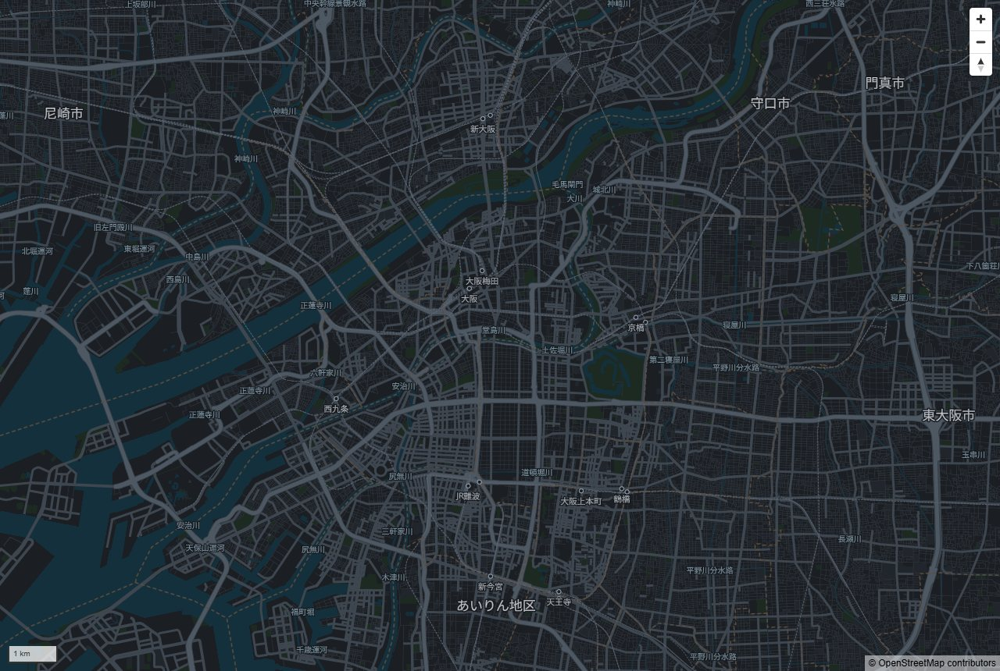

`#12/34.6937/135.5023`。駅（大阪梅田 / 大阪 / 新大阪 / 京橋 / 鶴橋 / 天王寺 …）と
河川名が出ています。`min_zoom` を見るようにした後の状態です。

## 2. 梅田 z15 — `2026-09-16-umeda-z15.jpg`

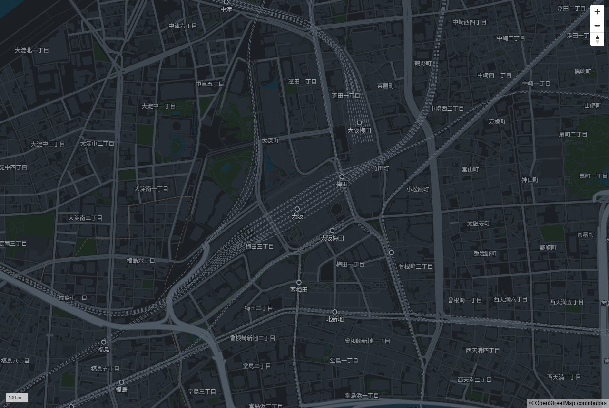

`#15/34.7024/135.4959`。建物・鉄道・丁目が出ます。

## 3. 関西 z9 — `2026-09-16-kansai-z9.jpg`

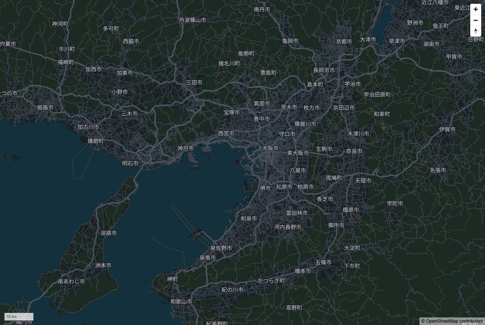

`#9/34.65/135.40`。切り出した範囲の広さが分かります。


## 全国タイルで撮ったもの（`japan.pmtiles` 3.6 GB・2026-09-16）

**全国ぶんは、これが初めて描かれた記録です。**切り出しと `pmtiles verify` は
通っていましたが、地図として出したことはありませんでした。
`pnpm serve -- japan` で配って撮っています。

| 場所 | 画像 |
|---|---|
| 全国 z5 | `2026-09-16-japan-z5.jpg` |
| 東京 z13 | `2026-09-16-tokyo-z13.jpg` |
| 京都 z14 | `2026-09-16-kyoto-z14.jpg` |
| 那覇 z13 | `2026-09-16-naha-z13.jpg` |
| 札幌 z12 | `2026-09-16-sapporo-z12.jpg` |

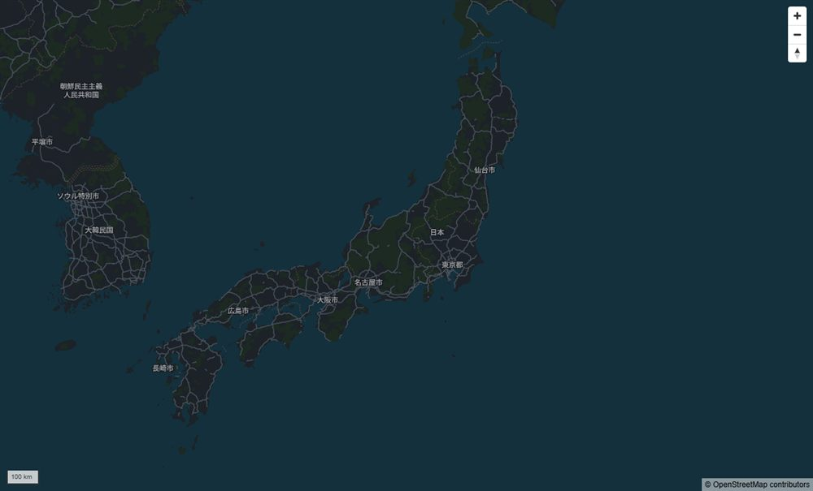

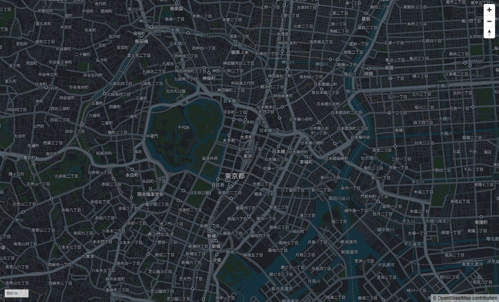

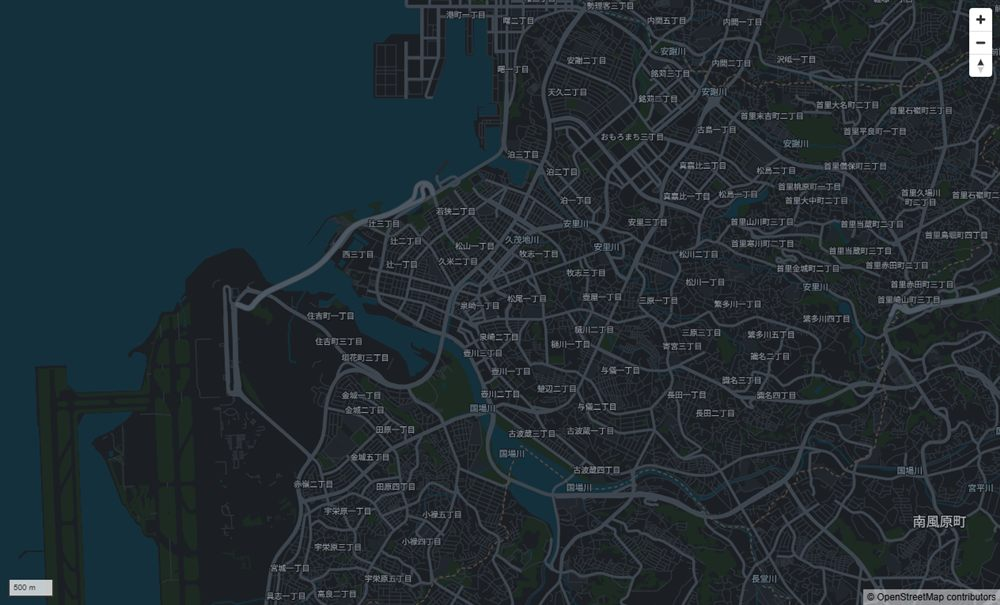

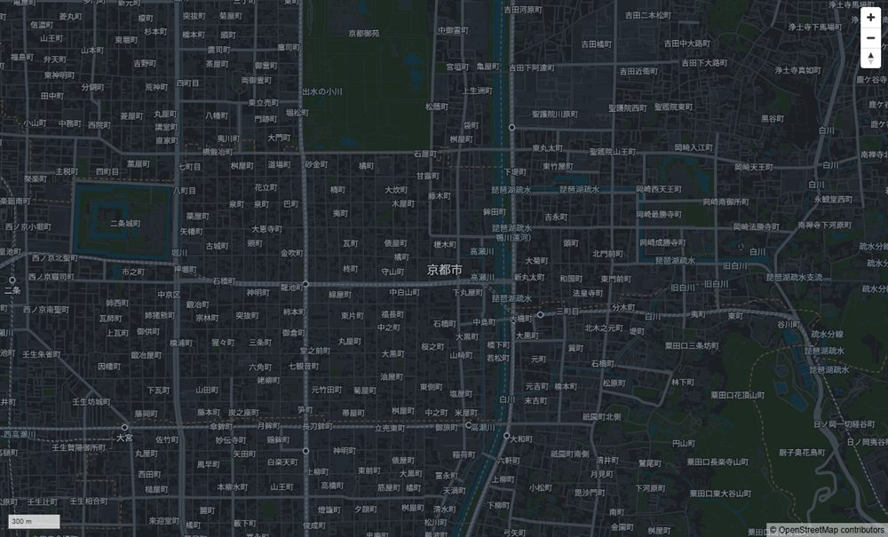

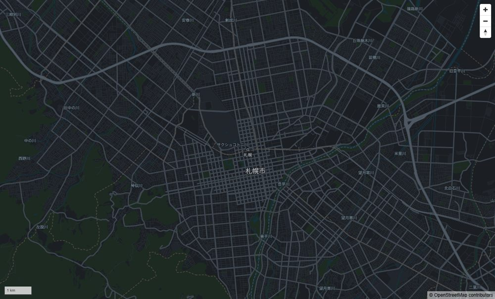

### ここで分かったこと

- **南北の端まで入っています。**那覇（26.2°N）も札幌（43.1°N）も描けました。
  bbox は与那国〜択捉で切ってあり、遠方の島を落としていません。
- **日本の外も入っています。**z5 で朝鮮半島の道路と地名（ソウル特別市・平壌市）が
  出ます。bbox はタイル単位で切るため、境界のタイルに隣国が含まれます。
  **消すなら描画側（スタイル）で絞る話**になります。
- **市名のラベルが、丁目ラベルに負けて消える**現象が那覇でも出ています
  （「那覇市」が出ていません）。大阪と同じで、衝突の優先順位が無いためです。


## 部品（Web Components）で置いた地図 — S2

`apps/demo/elements.html` を撮ったもの。地図と目印 3 つを **HTML の要素だけ**で
置いています（`<mmj-map>` / `<mmj-marker>`）。使い方は `docs/elements/README.md`。

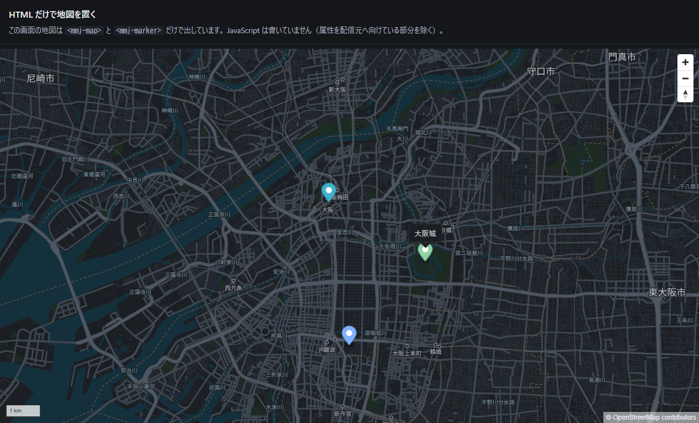

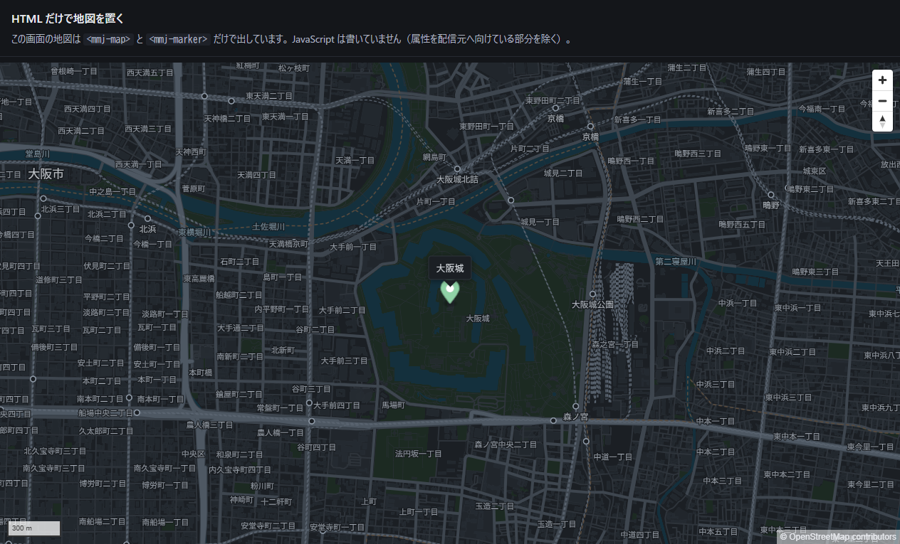

**撮って初めて分かったこと（3 件）**

1. **文字が読めない。**MapLibre のポップアップは白地で、文字色をページから継承します。
   暗いページの明るい文字が、そのまま白地に乗っていました（2026-09-16）。
2. **右上に「謎の四角」が出る。**閉じるボタン（×）が `position:absolute; right:0; top:0` で
   置かれていて、「大阪城」のような短い文字だと箱が狭く、**× が文字に重なって潰れて見える**
   （2026-09-17・人が見て指摘）。閉じるボタンを出さないようにしました。
   **閉じる手段は奪っていません**（地図か目印を押せば閉じます）。
3. **白い紙が 1 枚浮く。**暗い地図の上に MapLibre 既定の白地が乗っていました。
   `styles/modern-dark.json` にある色だけで揃えました（**新しい色は作っていません**。
   借りていることはテストで縛ってあります）。

**3 つとも、テストは全部通っていました。撮らなければ、そして人が見なければ気づきません。**

## 点をまとめたところ — `<mmj-cluster>`（2026-09-17）

`apps/demo/cluster.html` を撮ったもの。**200 点は合成データで、実在の場所ではありません**
（作り方は `apps/demo/data/README.md`）。まとめる計算は MapLibre の GeoJSON source が
やっています（D-011）。

| 場所 | 画像 | 出ているもの |
| --- | --- | --- |
| 大阪 z11 | `2026-09-17-cluster-z11.jpg` | 70 / 57 / 40 / 3 の 4 つのまとまり（残り 30 は堺で画面外） |
| 梅田 z15 | `2026-09-17-cluster-z15.jpg` | `max-zoom` 14 を越えたので、1 点ずつ |

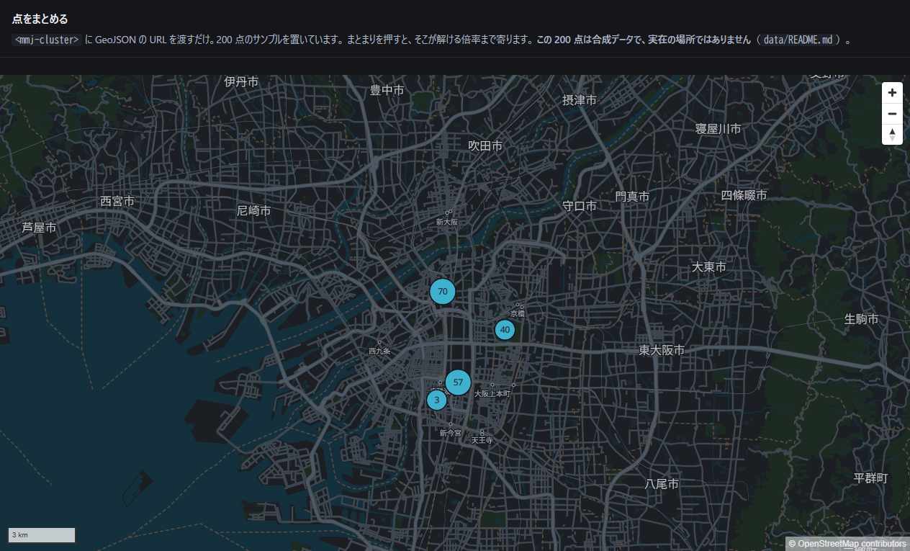

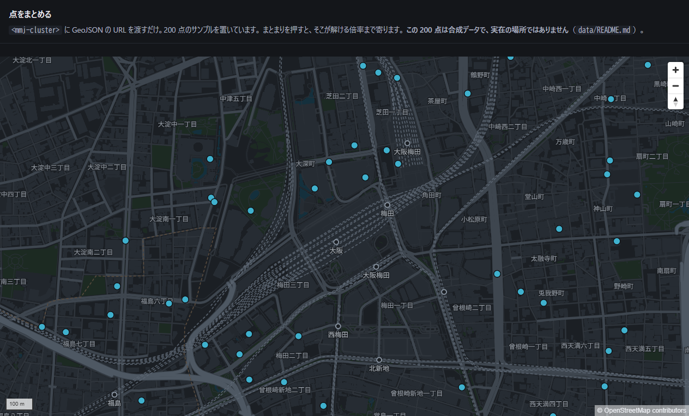

## 自前の POI を重ねたところ — `<mmj-poi>`（2026-09-17）

`apps/demo/poi.html`。名前は `shop_name` から取っています。
**8 点は合成データで、実在の店舗ではありません。**

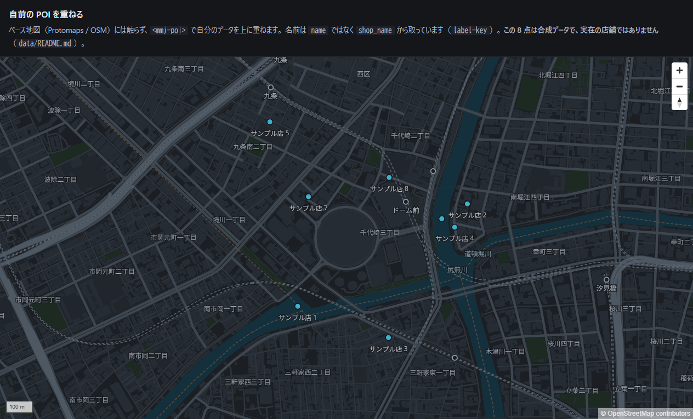

**この 1 枚に、POI の問題がそのまま写っています。**

- 中央の丸い建物が**京セラドーム**です。**建物は描けていますが、名前がありません。**
  スタイルに POI レイヤが無いためです（`.claude/proposals/2026-09-17-poi.md`）
- 「ドーム前」駅の名前は出ています。**駅だけは描いているため**です
- 自前 POI は 8 点置いて、**名前が出ているのは 7 つ**。「サンプル店 6」は
  衝突で消えました（点は残っています）

## 切り出す形を変えたあとの全国（2026-09-17）

太平洋を落として **3.37 GiB → 2.60 GiB** にしたあとの実物（D-013）。

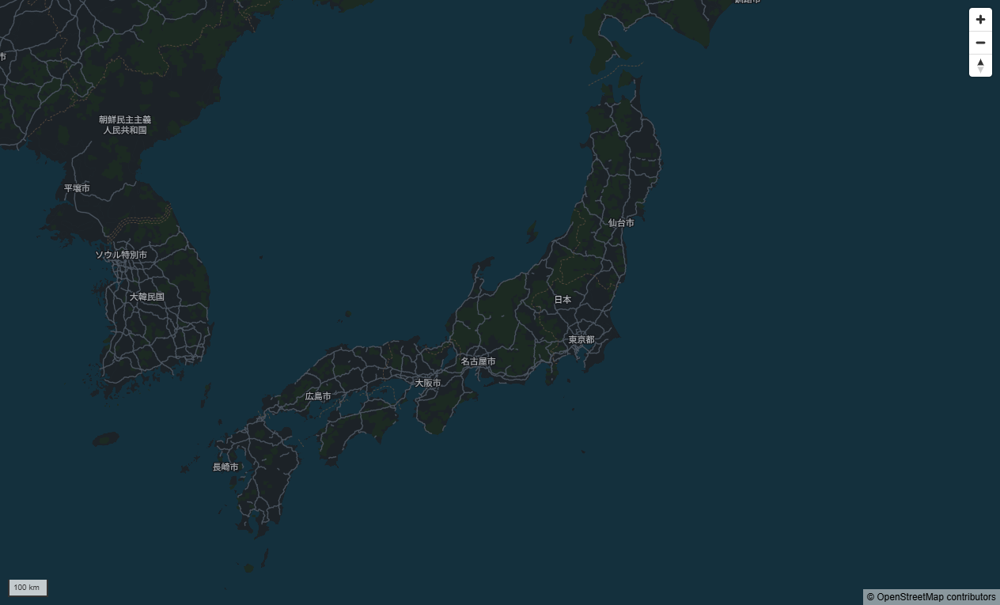

**撮って初めて分かったこと**: 最初の版では、東京の東の太平洋に**黒い矩形の穴**が出ました。
低い倍率まで region で切ったせいで、海のタイルが無かったためです。
**タイル件数も verify も正常で、テストも全部通っていました。**撮らなければ気づきません。
いまは z10 以下を bbox 全域で取っているので、穴はありません。

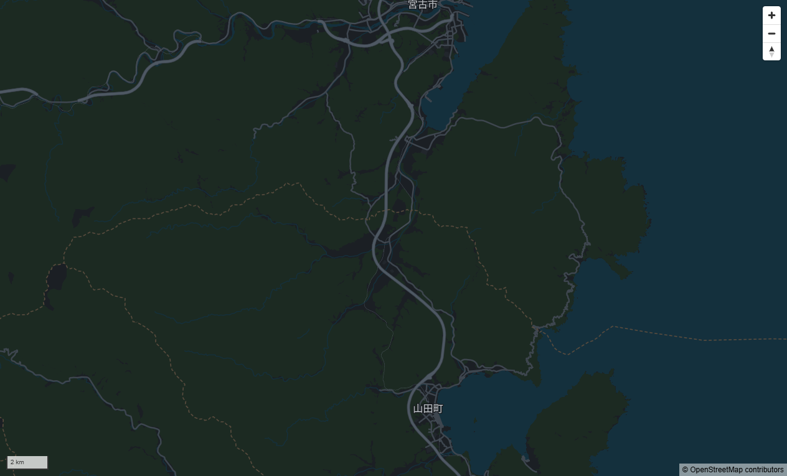

region の境界に一番近い陸地（本州最東端・魹ヶ崎）を、切り替え倍率のすぐ上で撮ったもの。
**海岸線の外にも穴はありません。**

## 人に見てほしい点（AI は判断しません）

1. **z15 で丁目ラベルが多すぎないか。** 「大深町」「茶屋町」などの町名が、駅名と
   ほぼ同じ重みで並びます。密度は `DESIGN.md` の領域です。
2. **z12 で「大阪市」のラベルが出ていません。** 周りの 尼崎市 / 守口市 / 門真市 /
   東大阪市 は出ています。データには入っている（`min_zoom` 3）ので、
   **駅ラベルとの衝突で負けている**と考えられます。
   直すなら `symbol-sort-key` で優先順位を決める話になりますが、
   **どのラベルを勝たせるかは設計判断**なので、提案に留めています。
3. **z9 で緑の面が強くないか。** 山地の landuse が広く、地図全体が緑に寄ります。
4. **「あいりん地区」が z12 で市名と同じ重みで出ています。** これは上流（OSM）の
   `place` の値をそのまま写した結果です。**表示するかどうかは人が決めてください。**
5. **まとまりの丸の色（`#3FB1CE`）が、この地図に合っているか。**
   新しく作った色ではなく **MapLibre の既定値**を借りているだけです（D-011）。
   暗い地図の上で浮きすぎ／沈みすぎがあれば、そこは `DESIGN.md` の領域です。
   **いま入っている色は承認された色ではありません。**
